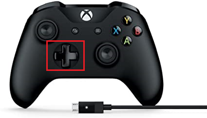

# Button bindings that we can later connect into autonomous

XBox Controller has POV buttons, we can use them for arm control


Probably will be best to test each of the commands below right as you create them.
That is, test the one you created before proceeding to the next one. 

## 1. POV-right button to eject the note (but the arm has to be at good angle for that)
First, go to `RobotContainer.java` and somewhere add a function that creates an eject command
(note how it has to do two things: bring the arm to an angle that's good for ejecting, and then run intake in reverse direction while operator keeps that button pressed)

```
  private Command makeEjectNoteCommand() {
    Command dropArm = new RaiseArm(m_arm, 30); // is 30 a good angle to eject reliably? 
    Command eject = new EjectNote(m_intake, m_arm, 0.5); // is 50% a good intake reverse speed for ejecting?
    Command result = new SequentialCommandGroup(dropArm, eject);
    return result;
  } 
```

, and after this command is written make the down button invoke this command with `driveTowards=false`:
go inside of `configureButtonBindings()` function, create a command there and bind it to POV-right button:
```
    // POV right: eject the note reliably
    Command ejectNote = makeEjectNoteCommand();
    m_driverJoystick.povRight().whileTrue(ejectNote);

```
^^ note how we used `whileTrue` method, it means that the command will only be allowed to run while button is pressed.
And the moment the operator stops holding the button, the command is ended.


## 2. POV-down button to pick up without driving towards the target (driver is supposed to do it)

First, go to `RobotContainer.java` and somewhere add a function that creates a pick up command
(note how it has to do three things: bring the arm down, run intake until the note is inside, and then move the note a few inches back to unblock the shooter)

```
  private Command makePickupNoteCommand(boolean driveTowards, double armAngleAfterPickup) {
    // 0. strart dropping to the pickup angle, but do not wait until that completes (just "request" the arm to get to new angle)
    RequestArmAngle beAtPickupAngle = new RequestArmAngle(m_arm, 15);

    // 1. take the note
    Command grabNote;
    if (driveTowards == true)
      grabNote = new IntakeNote(m_intake, m_arm, m_drivetrain, armAngleAfterPickup);
    else /* if driveTowards==false, we are not supposed to drive towards the note, so do not let the command use m_drivetrain */
      grabNote = new IntakeNote(m_intake, m_arm, null, armAngleAfterPickup);

    // 2. after the note is in, it might be blocking the shooter from spinning: move it back by a few inches
    Command unblockShooter = new EjectNote(m_intake, null, 0.05).withTimeout(0.1); // speed=30%, and add timeout=0.2

    // 0 + 1 + 2
    Command result = new SequentialCommandGroup(beAtPickupAngle, grabNote, unblockShooter);
    return result;
  }
```

, and after this command is written make the down button invoke this command with `driveTowards=false`:
go inside of `configureButtonBindings()` function, create a pickup command there and bind it to POV-down button:
```
    // POV down: pick up the piece using just arm (but not automatically driving towards it)
    Command pickUpWithoutDriving = makePickupNoteCommand(false, 30); // raise arm by 30 degrees after pickup
    m_driverJoystick.povDown().whileTrue(pickUpWithoutDriving);

```
^^ note how we used `whileTrue` method, it means that the command will only be allowed to run while button is pressed.
And the moment the operator stops holding the button, the command is ended.


## 3. POV-left button to pick up *with* driving towards the target (this approach can also be used in autonomous)
We already did most of the work above, because the appropriate command is can already be created with
```
makePickupNoteCommand(true, 30)
```
(notice how the first argument became `driveTowards=true`).

All that's left to do is go inside of `configureButtonBindings()` function and bind it to a button
```
    // POV left: pick up the piece using arm and drivetrain (to automatically wiggle-drive towards it, maximizing the chances of pickup)
    Command pickUpWithoutDriving = makePickupNoteCommand(true, 30); // raise arm by 30 degrees after pickup
    m_driverJoystick.povLeft().whileTrue(pickUpWithoutDriving);

```

Now, try it: robot tries to wiggle right and left in order to pick up the gamepiece even if it wasn't perfectly in the center, but the duration and speed of those wiggles is not right. Can you find those things in the code and calibrate them?

## 4. POV-up button to raise the arm, and fire the gamepiece

First, go to `RobotContainer.java` and somewhere add a function that creates a raise-arm-and-shoot command
(note how it has to do two things one after another: raise, and *only* when the angle is good ... then shoot, which is different from what `RequestArmAngle` does by just requesting an angle but not waiting for it)
```
  private Command makeRaiseAndShootCommand(double aimArmAngle, double shootingFlywheelRpm) {
    Command raiseArm = new RaiseArm(m_arm, aimArmAngle);

    Command shoot = new Shoot(m_shooter, m_intake, shootingFlywheelRpm);

    Command result = new SequentialCommandGroup(raiseArm, shoot);
    return result;
  }
```

, now here is the trick -- to bind this to a button we cannot use `whileTrue()` anymore! (we don't want the command to stop in the middle and the gamepiece left stuck in the shooter if the operator releases the button before the shooter is fully done firing).

Instead, this command should be bound to a button using `onTrue()` method (this means, the command will start executiom when the button is pushed, but it will only finish when it is done).

So, inside of `configureButtonBindings()` function, please add something like this:

```
    // POV up: raise, aim and shoot at angle 37,and rpm 2000 (not all the way to 5700, since the target is nearby)
    Command raiseAndShoot = makeAimAndShootCommand(37, 2000);
    m_driverJoystick.povUp().onTrue(raiseAndShoot);
```
.

## 5. Challenge
For joystick button "Y" can you write and bind a command that would lift the arm to angle 70 or whatever works best to drop a gamepiece into the amp?

## 6. Another challenge
For joystick button "X" can you write and bind a command that would eject the gamepiece immediately (no matter at what angle the arm was).

(5+6 is what we need to score gamepieces into the amp, of course)
