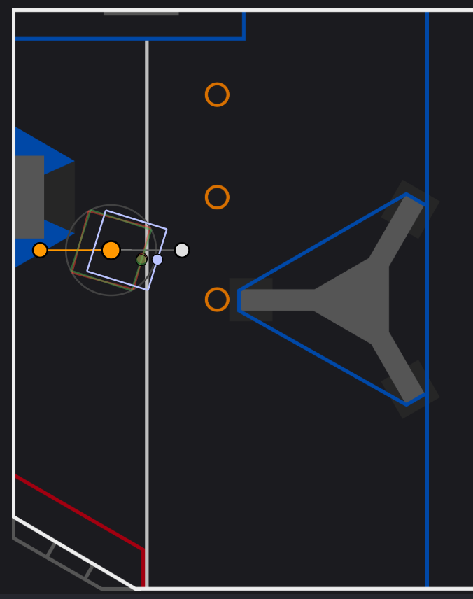

# Button bindings that we can later connect into autonomous

XBox Controller has POV buttons, we can use them for arm control


Probably will be best to test each of the commands below right as you create them.
That is, test the one you created before proceeding to the next one. 

## 1. POV-right button to eject the note (but the arm has to be at good angle for that)
First, go to `RobotContainer.java` and somewhere add a function that creates an eject command
(note how it has to do two things: bring the arm to an angle that's good for ejecting, and then run intake in reverse direction while operator keeps that button pressed)

```
  private Command makeEjectNoteCommand() {
    double ejectIntakeSpeed = 0.17; // is 0.17 a good speed to eject the note?

    // if we eject the note into the amp, we need to eject at high angle and then push that note with the arm (at lower angle)
    Command raiseArm = new RaiseArm(m_arm, ArmConstants.kArmAngleToEjectIntoAmp, 0); // zero delay after arm is raised, a couple of degrees oscillation is fine 
    Command ejectAndPush = new EjectNote(m_intake, m_arm, ejectIntakeSpeed, ArmConstants.kArmAngleToPushIntoAmp);

    Command result = new SequentialCommandGroup(raiseArm, ejectAndPush);
    return result;
  }
```

, and after this command is written make the down button invoke this command with `driveTowards=false`:
go inside of `configureButtonBindings()` function, create a command there and bind it to POV-right button:
```
    // POV right: eject the note reliably
    Command ejectNote = makeEjectNoteCommand();
    m_driverJoystick.povRight().onTrue(ejectNote);

```
^^ note how we used `onTrue` method, it means that the command will start when button is pushed, but you don't need to hold the button to keep the command running.
The command will end when it finishes, not when the operator releases the button.

Bonus: try the same with a more advanced version of this command
```
private Command makeConsistentEjectNoteCommand() {
    double ejectIntakeSpeed = 0.17; // is 0.17 a good speed to eject the note?
    Command raiseArm = new RaiseArm(m_arm, ArmConstants.kArmAngleToEjectIntoAmp, 0); // is 94 a good angle to eject the note into the amp reliably? 
    Command ejectAndPush = new EjectNote(m_intake, m_arm, ejectIntakeSpeed, ArmConstants.kArmAngleToPushIntoAmp); // is 80 a good angle for pushing the note in
    Command raiseEjectAndPush = new SequentialCommandGroup(raiseArm, ejectAndPush);

    // to do it more reliably, ensure consistent starting angle 
    Command dropToLowerAngle = new RaiseArm(m_arm, ArmConstants.kArmAngleToPushIntoAmp - 5, 0); // TODO: remove, this is a hack until arm PID coeffs are tuned
    Command raiseToPushAngle = new RaiseArm(m_arm, ArmConstants.kArmAngleToPushIntoAmp, 0); // good starting angle
    Command ejectRoutine = new SequentialCommandGroup(dropToLowerAngle, raiseToPushAngle, raiseEjectAndPush);

    // also ensure that bumper keeps touching the amp wall (easy: just be driving towards amp all this time)
    Command beDriving = m_drivetrain.run(() -> m_drivetrain.arcadeDrive(0.2, 0));

    // the result is "be driving until the eject routine is completed"
    return ejectRoutine.deadlineWith(beDriving);
  }
```

## 2. POV-down button to pick up without driving towards the target (driver is supposed to do it)

First, go to `RobotContainer.java` and somewhere add a function that creates a pick up command
(note how it has to do two things: run intake until the note is inside, and then move the note a few inches back to unblock the shooter)

```
   private Command makePickupNoteCommand(boolean driveTowards, double armAngleAfterPickup) {
    // 1. take the note
    Command grabNote;
    if (driveTowards == true)
      grabNote = new IntakeNote(m_intake, m_arm, m_drivetrain, armAngleAfterPickup);
    else /* if driveTowards==false, we are not supposed to drive towards the note, so do not let the command use m_drivetrain */
      grabNote = new IntakeNote(m_intake, m_arm, null, armAngleAfterPickup);

    // 2. after the note is in, it might be blocking the shooter from spinning: move it back by a few inches
    Command unblockShooter = new EjectNote(m_intake, null, 0.05, 0).withTimeout(0.1); // speed=5%, and add timeout=0.2

    // 0 + 1 + 2
    Command result = new SequentialCommandGroup(grabNote, unblockShooter);
    return result;
  }
```

, and after this command is written make the down button invoke this command with `driveTowards=false`:
go inside of `configureButtonBindings()` function, create a pickup command there and bind it to POV-down button:
```
    // POV down: pick up the piece using just arm (but not automatically driving towards it)
    Command pickUpWithoutDriving = makePickupNoteCommand(false, 80); // raise arm by 80 degrees after pickup
    m_driverJoystick.povDown().whileTrue(pickUpWithoutDriving);

```
^^ note how we used `whileTrue` method, it means that the command will only be allowed to run while button is pressed.
And the moment the operator stops holding the button, the command is ended.

Bonus: make the robot drive towards that note when the button is pressed.
```
    Command pickUpWhileDriving = makePickupNoteCommand(true, 80); // raise arm by 80 degrees after pickup
    m_driverJoystick.povDown().whileTrue(pickUpWhileDriving);
```

## 3. POV-left button to pick up using the camera (this approach can also be used in autonomous)
We already did most of the work above, now we can use the pick-up functionality but we need to add visual aiming ahead of pickup.
```
  private Command makeApproachAndPickupNoteCommand(double armAngleAfterPickup) {
    // raise arm to 80 degrees, to get it out of the way of blocking the camera
    var raiseArm = new RaiseArm(m_arm, 80, 0);

    // stop approaching the note visually when it's at -16 degrees below horizon, at our feet
    var whenToStop = new FollowVisualTarget.WhenToFinish(-16, 0, 0, false);

    // command 1: approach using camera
    var approachAndAim = new FollowVisualTarget(
      m_drivetrain, m_pickupCamera, CameraConstants.kNotePipelineIndex, CameraConstants.kNoteApproachRotationSpeed, CameraConstants.kNoteApproachSpeed,
      CameraConstants.kPickupCameraImageRotation, whenToStop);
    
    // command 2: pick up using the previously tested pick-up command
    var thenPickup = makePickupNoteCommand(true, armAngleAfterPickup);

    return new SequentialCommandGroup(raiseArm, approachAndAim, thenPickup);
  }
```

All that's left to do is go inside of `configureButtonBindings()` function and bind it to a button
```
    // POV left: pick up the piece using arm and drivetrain (to automatically wiggle-drive towards it, maximizing the chances of pickup)
    Command pickUpAutomatically = makeApproachAndPickupNoteCommand(80); // raise arm by 80 degrees after successful pickup
    m_driverJoystick.povLeft().whileTrue(pickUpAutomatically);

```

Now, try it: robot tries to wiggle right and left in order to pick up the gamepiece even if it wasn't perfectly in the center, but the duration and speed of those wiggles is not right. Can you find those things in the code and calibrate them?

## 4. POV-up button to raise the arm, and fire the gamepiece at a pre-set angle (calibrated to firing from close)

First, go to `RobotContainer.java` and somewhere add a function that creates a raise-arm-and-shoot command
(note how it has to do two things one after another: raise, and *only* when the angle is good ... then shoot, which is different from what `RequestArmAngle` does by just requesting an angle but not waiting for it)
```
  private Command makeRaiseAndShootCommand(double aimArmAngle, double shootingFlywheelRpm) {
    Command raiseArm = new RaiseArm(m_arm, aimArmAngle, 0.5);
    // 0.5 = extra 0.5s delay for oscillations to stop so we have precise angle (oscillations happen because we did not calibrate the PID gains on the arm yet)

    Command shoot = new Shoot(m_shooter, m_intake, shootingFlywheelRpm);

    Command result = new SequentialCommandGroup(raiseArm, shoot);
    return result;
  }
```

, now here is the trick -- to bind this to a button we cannot use `whileTrue()` anymore! (we don't want the command to stop in the middle and the gamepiece left stuck in the shooter if the operator releases the button before the shooter is fully done firing).

Instead, this command should be bound to a button using `onTrue()` method (this means, the command will start executiom when the button is pushed, but it will only finish when it is done).

So, inside of `configureButtonBindings()` function, please add something like this:

```
    // POV up: raise, aim and shoot at angle 37,and rpm 5700 (unnecessary to go that high though, to be improved)
    Command raiseAndShoot = makeAimAndShootCommand(37, 5700);
    m_driverJoystick.povUp().onTrue(raiseAndShoot);
```

## 5. Right bumper button: use camera to drive up to the speaker, and then raise-and-shoot into it
Here we can reuse the raise-and-shoot command we already created. We just need to add the logic to visually find the speaker and drive up to it.

```
  private Command makeApproachAndShootCommand(double aimArmAngle, double shootingFlywheelRpm, String setAngleFromSmartDashboardKey) {
    // 1. use camera to approach the speaker
    double approachSpeed = -0.3, seekingSpeed = 0.1; // set them to zero if you want to just aim
    var approachAndAim = new FollowVisualTarget.WhenToFinish(0, 12, 0, true);
    var aim = new FollowVisualTarget(
      m_drivetrain, m_aimingCamera, CameraConstants.kSpeakerPipelineIndex,
      seekingSpeed, approachSpeed,
      CameraConstants.kAimingCameraImageRotation,
      approachAndAim);

    // 2. and then use the command that we created in part 4 above
    var raiseAndShoot = makeRaiseAndShootCommand(aimArmAngle, shootingFlywheelRpm, setAngleFromSmartDashboardKey);
    var raiseAndShootIfFound = raiseAndShoot.onlyIf(aim::getEndedWithTarget);

    // 1 + 2
    return new SequentialCommandGroup(aim, raiseAndShootIfFound);
  }
```

This can be bound to right bumper button, inside of `configureButtonBindings()` function:
```
    Command approachAndShoot = makeApproachAndShootCommand(31.5, 2850, "armShootAngle"); // can make it "armShootAngle"
    joystick.rightBumper().whileTrue(approachAndShoot);
```

## 6. Left bumper button: lock the wheels in X position, measure how far the speaker is, and pick the shooting arm angle for that shot

A bit more complicated: first we need to aim horizontally, then pick the arm angle, and only then shoot:
```
  private Command makeBrakeAndShootCommand() {
    // -- first use camera to rotate and make sure we are aimed directly at the speaker (but not approach it: approachSpeed=0)
    double approachSpeed = 0.0; // do not approach, just aim
    double seekingSpeed = 0.0; // do not seek, just aim
    var dontDriveJustAim = new FollowVisualTarget.WhenToFinish(0, 0, 0, true);
    var aim = new FollowVisualTarget(
      m_drivetrain, m_aimingCamera, CameraConstants.kSpeakerPipelineIndex,
      seekingSpeed, approachSpeed,
      CameraConstants.kAimingCameraImageRotation,
      dontDriveJustAim);


    // -- aiming vertically and shooting, with wheels locked in X position
    double initialDropAngle = 22;
    double lowestPossibleFiringAngle = 37;
    double shootingFlywheelRpm = 5700;

    Command dropArm = new RaiseArm(m_arm, initialDropAngle, 0); // TODO: maybe comment out dropArm, and see if determinism breaks?
    Command raiseArm = new RaiseArm(m_arm, lowestPossibleFiringAngle, ArmConstants.kExtraDelayForOscillationsToStop, this::getGoodFiringAngle, null);
    Command shoot = new Shoot(m_shooter, m_intake, m_arm, shootingFlywheelRpm);
    Command raiseAfterwardsToSaveEnergy = new RequestArmAngle(m_arm, ArmConstants.kArmAgleToSaveEnergy);
    Command raiseArmAndShoot = new SequentialCommandGroup(dropArm, raiseArm, shoot, raiseAfterwardsToSaveEnergy);

    Command keepWheelsOnXBrake = m_drivetrain.run(m_drivetrain::setX); // keep wheels on X brake, otherwise opponent robots can easily disrupt aiming
    Command raiseArmAndShootWithWheelsLocked = raiseArmAndShoot.deadlineWith(keepWheelsOnXBrake);


    Command shootIfAimed = raiseArmAndShootWithWheelsLocked.onlyIf(aim::getEndedWithTarget);
    return new SequentialCommandGroup(aim, shootIfAimed);
  }
```

, and it can be bound to the left bumper button:
```
    Command brakeAndShoot = makeBrakeAndShootCommand();
    joystick.leftBumper().whileTrue(brakeAndShoot);
```

## Autonomous 1: fire the preloaded gamepiece, pick another one, fire it too and escape
Based on Crescendo videos so far, everyone does something like this (and it works):
 * wait for a couple of seconds for the faster robots on your alliance to score their first piece
 * then score, pick up some notes and score them
 * and then escape the scoring zone using some trajectory
 (weak robots escape in order to leave uncongested space for stronger robots to score more,
  strong robots escape to centerline to have a strategic advantage at the start of teleop).
.

So, let's do just that. We can score a lot of points this way.
Inside of GameConstants.java we have GameConstants class, in which we can define:
 * starting point and robot angle heading
 * escape trajectory at the end of autonomous (do we just go to the side, or to the center line?)
.

Here is an example, if a robot in the beginning it sitting at (X, Y) = (1.40, 4.80) like this:



and wants to eventually escape along the right approach to centerline (kBlueApproachCenerlineFromLeft) at the end of autonomous routine:


.

In `GameConstants.java` we then need to have:
```
public final class GameConstants {
  // initial position of robot on the field
  public static final double kInitialX = 1.90;
  public static final double kInitialY = 4.50;
  public static final double kInitialHeadingDegrees = 0; // should be around 0 for blue and around 180 for red

  // autonomous escape trajectory to take, after all the pieces are scored
  public static final List<Translation2d> kAutonomousEscapeTrajectory = FieldMap.kBlueApproachCenerlineFromLeft; // can be = null, if no escape is needed
  public static final double kAutonomousEscapeFinalHeading = 0; // where to point at the end of autonomous escape
}
```

, and finally we can put together an autonomous routine that would fire gamepieces and pick them up the same way as teleop driver would do by clicking buttons.

Here is an example function for autonomous routine that scores two gamepieces in total (one preloaded and one picked up).
We can put it at the end of `RobotContainer`` class in `RobotContainer.java`.

```
  /* A command to fire the note immediately, then pick and fire another,
   * and then follow an escape trajectory defined in GameConstants */

   private Command makeAutonomousCommandToScoreTwoNotes() {
    // make sure we are starting with correct coordinates
    Command resetOdometry = new ResetOdometry(m_drivetrain);

    // fire a pre-loaded note that is already sitting on a robot
    // -- do what clicking "right bumper" would do
    Command score1 = makeApproachAndShootCommand();

    // pickup another note, and fire it if pickup was a success
    // -- do what clicking "POV left" would do
    Command pickup2 = makeApproachNoteCommand(80).withTimeout(5); // no more than 5 seconds to pick up a note please
    // -- do what clicking "left bumper" would do
    Command score2 = makeBrakeAndShootCommand().onlyIf(m_intake::isNoteInside); // only shoot it, if the note is inside
  
    // all the pickup and scoring together
    Command allPickupAndScoring = new SequentialCommandGroup(resetOdometry, score1, pickup2, score2);

    // if the escape trajectory is null, do not escape anywhere: our trajectory is just pickup and scoring
    if (GameConstants.kAutonomousEscapeTrajectory == null)
      return allPickupAndScoring;

    // otherwise (if escape trajectory is not null), attach the escape command at the end to follow that trajectory
    Command escape = new SwerveTrajectoryToPoint(
      m_drivetrain, GameConstants.kAutonomousEscapeTrajectory, Rotation2d.fromDegrees(GameConstants.kAutonomousEscapeFinalHeading));

    Command result = new SequentialCommandGroup(allPickupAndScoring, escape);
    return result;
  }
```

But how do we make the robot actually do this when it's time for autonomous driving?
To do that, we'll need to go to the end of `RobotContainer.java` and overwrite the contents of `getAutonomousCommand` function:
```
  public Command getAutonomousCommand() {
    Command delay = new WaitCommand(1.0); // wait for one second for the stronger robots on the alliance to score their first note (we'll need to appropriately each time)
    Command action = makeAutonomousCommandToScoreTwoNotes();
    return new SequentialCommandGroup(delay, action);
  }
```

## Challenge
Above is an example function that creates an command to score two notes and escape.
It was called `makeAutonomousCommandToScoreTwoNotes()`.

Can you write `makeAutonomousCommandToScore1Note()`?

Can you write `makeAutonomousCommandToScore3Notes()`?

Can you write `makeAutonomousCommandToScore4Notes()`? (in case no robot on our alliance can score at all)

Can you think of a way to write `getAutonomousCommand()` using one of those functions you wrote?

Let's test them all.